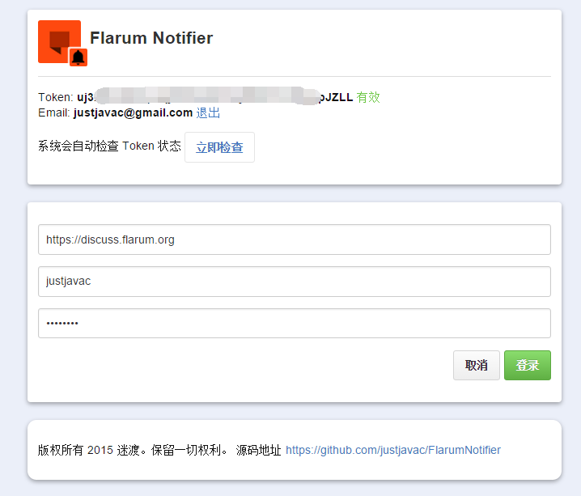

# FlarumNotifier

Chrome Extension - Displays your [Flarum](http://flarum.org) discussions unread count.

## Introduction

It checks the Flarum discussion API every minute. 

## Screenshot

## Install

- [Chrome Web Store](https://chrome.google.com/webstore/detail/flarum-notifier/ejpfiicmhnjilbdomflkdcbflomoobmh)

### Credits

- [justjavac](https://github.com/justjavac)

## License

FlarumNotifier is released under the GPL License. See the bundled [LICENSE](LICENSE) file for details.