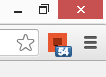
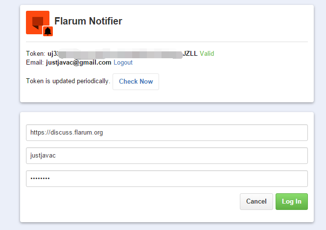

# Flarum Notifier

Chrome Extension - Displays your <a href="http://flarum.org" target="_blank">Flarum</a> discussions unread count.

## Introduction

It checks the Flarum discussion API every minute. 

## Screenshot

## Install

- [Chrome Web Store](https://chrome.google.com/webstore/detail/flarum-notifier/ejpfiicmhnjilbdomflkdcbflomoobmh)

## Credits

- <a href="https://github.com/justjava" target="_blank">justjavac</a>

## License

FlarumNotifier is released under the GPL License. See the bundled [LICENSE](LICENSE) file for details.